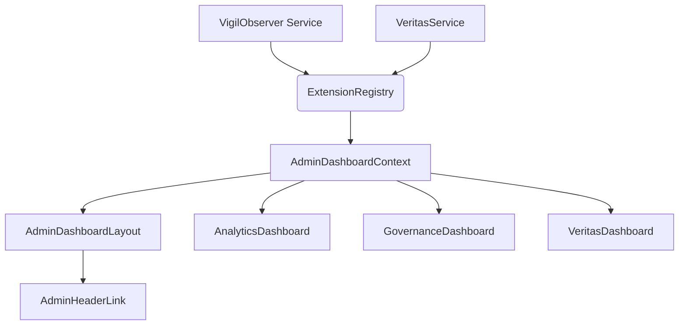

# Component Connection and Data Flow Plan

## Overview

This document details the component connections and data flow for integrating VigilObserver and Veritas services with the Promethios admin dashboard. It builds upon the UI Integration Plan and UI Test Validation Plan.

## Key Components and Data Sources

1.  **VigilObserver**: Provides data on constitutional rule violations, enforcements, compliance status, and overall governance metrics.
2.  **VeritasService**: Provides data on text verification, emotional analysis, trust signals, and related metrics.
3.  **ExtensionRegistry**: Acts as the central hub for accessing implementations of VigilObserver and VeritasService.
4.  **AdminDashboardContext**: Manages and provides global state for the admin dashboard, including data fetched from VigilObserver and VeritasService.
5.  **AnalyticsDashboard**: Displays integrated analytics, including governance metrics from VigilObserver.
6.  **GovernanceDashboard (New)**: A new dashboard section dedicated to displaying detailed VigilObserver data (compliance, violations, enforcements).
7.  **VeritasDashboard (New)**: A new dashboard section dedicated to displaying detailed VeritasService data (verification results, emotional analysis, trust signals).

## Data Flow Diagram

## Component Connection Details

### 1. ExtensionRegistry Connections

*   **VigilObserver Extension Point (`vigilObserver`)**:
    *   **Implementation**: The fixed `VigilObserver` class (`src/observers/vigil/index.js`).
    *   **Methods Exposed**: `getObservations`, `getMetrics`, `getViolations`, `getEnforcements`, `analyzeComplianceStatus`.
    *   **Registration**: To be done in a new file, e.g., `src/core/extensions/vigilObserverExtension.ts`, which will be called during application initialization.
*   **VeritasService Extension Point (`verification`)**:
    *   **Implementation**: Existing `VeritasService` (`src/core/veritas/VeritasService.ts`).
    *   **Methods Exposed**: `verifyText`, `compareVerification`, `storeVerificationResult`, `getVeritasObservations`, `getVeritasMetrics`.
    *   **Registration**: Already handled within `VeritasService.ts`.

### 2. AdminDashboardContext Connections

*   **Data Fetching**: `AdminDashboardContext` will use the `ExtensionRegistry` to get instances of `VigilObserver` and `VeritasService` implementations.
*   **State Management for VigilObserver Data**:
    *   `governanceMetrics: any`
    *   `complianceStatus: any`
    *   `violations: VigilObservation[]` (or appropriate type)
    *   `enforcements: any[]`
    *   `loadGovernanceData(): Promise<void>`: Fetches data from `VigilObserver` via `ExtensionRegistry` and updates the context state.
*   **State Management for VeritasService Data**:
    *   `veritasMetrics: VeritasMetrics | null`
    *   `veritasObservations: VeritasObservation[]`
    *   `loadVeritasData(): Promise<void>`: Fetches data from `VeritasService` via `ExtensionRegistry` and updates the context state.
*   **Error Handling**: Implement robust error handling for data fetching operations within the context.
*   **Loading States**: Manage `isLoading` states for both VigilObserver and Veritas data fetching.

### 3. UI Component Connections

*   **AdminHeaderLink (`src/admin/AdminHeaderLink.tsx`)**:
    *   Will include a new link to the `/admin/dashboard/governance` route.
    *   Will include a new link to the `/admin/dashboard/veritas` route.
*   **AdminDashboardLayout (`src/admin/AdminDashboardLayout.tsx`)**:
    *   Update `navItems` to include entries for "Governance" and "Veritas" dashboards, pointing to their respective routes.
    *   The `<Outlet />` will render `GovernanceDashboard` or `VeritasDashboard` based on the route.
*   **AnalyticsDashboard (`src/admin/AnalyticsDashboard.tsx`)**:
    *   Consume `governanceMetrics` and `complianceStatus` from `AdminDashboardContext`.
    *   Display relevant VigilObserver metrics (e.g., total violations, compliance score) in `AnalyticsCard` components.
*   **GovernanceDashboard (New - `src/admin/GovernanceDashboard.tsx`)**:
    *   Consume `governanceMetrics`, `complianceStatus`, `violations`, and `enforcements` from `AdminDashboardContext`.
    *   Display detailed compliance status (e.g., using `ComplianceStatusVisualization`).
    *   Display a table of violations (e.g., using `ViolationsTable`) with filtering and sorting.
    *   Display key metrics using `GovernanceMetricCard` components.
*   **VeritasDashboard (New - `src/admin/VeritasDashboard.tsx`)**:
    *   Consume `veritasMetrics` and `veritasObservations` from `AdminDashboardContext`.
    *   Display Veritas metrics (average accuracy, emotional score, trust score, empathy score) using `VerificationMetricCard` components.
    *   Display a table of verification history (e.g., using `VerificationHistoryTable`).
    *   Integrate `VerificationComparisonTool` and `EmotionalAnalysisDisplay` components.

## Data Preparation and Hook Points

### VigilObserver Data

*   **`VigilObserver.getMetrics()`**: Ensure this method returns data in a structure easily consumable by `AnalyticsCard` and `GovernanceMetricCard` components.
    *   Example: `{ violations: { total: 10, byRule: {...} }, enforcements: { total: 5, byAction: {...} }, complianceScore: 85 }`
*   **`VigilObserver.analyzeComplianceStatus()`**: Ensure this returns a comprehensive status object.
    *   Example: `{ status: 'violations_detected', compliant: false, violationCount: 10, enforcementCount: 5, complianceScore: 85, recentViolations: [...], criticalViolations: [...] }`
*   **`VigilObserver.getViolations()` and `VigilObserver.getEnforcements()`**: Ensure these return arrays of objects suitable for table display, including timestamps, severity, rule IDs, etc.

### VeritasService Data

*   **`VeritasService.getVeritasMetrics()`**: Ensure this returns metrics in a structure suitable for `VerificationMetricCard` components.
    *   Example: `{ totalVerifications: 100, averageAccuracy: 90, averageEmotionalScore: 75, ... }`
*   **`VeritasService.getVeritasObservations()`**: Ensure this returns an array of `VeritasObservation` objects suitable for the `VerificationHistoryTable`.

### UI Hooks in `AdminDashboardContext`

*   The `loadGovernanceData` and `loadVeritasData` functions will be the primary hooks for fetching and updating data.
*   These functions should be called appropriately, e.g., on initial load of the context or when a user navigates to a relevant dashboard section.
*   Consider adding refresh mechanisms or real-time updates if required by the application's design (though not explicitly in scope for this initial integration plan).

## Next Steps

1.  Implement the new `GovernanceDashboard` and `VeritasDashboard` components based on the UI Integration Plan.
2.  Update `AdminDashboardContext` to include the new state and data fetching logic for VigilObserver and VeritasService.
3.  Update `AdminHeaderLink` and `AdminDashboardLayout` to include navigation to the new dashboards.
4.  Integrate VigilObserver data into the existing `AnalyticsDashboard`.
5.  Implement the `src/core/extensions/vigilObserverExtension.ts` file to register the VigilObserver extension.
6.  Thoroughly test all connections and data flows as per the UI Test Validation Plan.

This plan provides the necessary details to prepare for the actual coding and implementation of the UI integration, ensuring that data flows correctly between the backend services and the frontend components.
