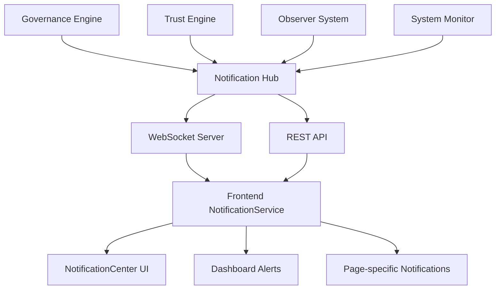

# Promethios Notification System Integration Plan

## Overview
This document outlines the comprehensive plan for integrating the newly built notification system with the existing Promethios governance backend and UI components.

## Current State Assessment

### ✅ Notification Infrastructure (COMPLETED)
- **NotificationService** - Core notification management with localStorage
- **NotificationRegistry** - Provider/handler management system  
- **LocalStorageNotificationStorage** - Persistent storage without Firebase dependency
- **NotificationCenter** - React component integrated into HeaderNavigation
- **useNotifications hook** - Easy React integration
- **TestNotificationProvider** - Development testing capabilities

### 🎯 Integration Targets

## UI/UX Component Mapping

### 1. Dashboard Components
**Location:** `/src/pages/DashboardPage.tsx`, `/src/components/dashboard/`

**Current State:**
- Mock dashboard with static metrics
- Trust score visualization
- System health indicators
- Quick actions panel

**Notification Integration Needs:**
```typescript
// Dashboard-specific notifications
interface DashboardNotifications {
  trustScoreChanges: {
    type: 'trust_boundary_breach' | 'trust_improvement';
    threshold: number;
    currentScore: number;
    trend: 'up' | 'down';
  };
  systemHealth: {
    type: 'system_event';
    component: string;
    status: 'healthy' | 'warning' | 'critical';
  };
  quickActions: {
    type: 'observer_suggestion';
    action: string;
    priority: 'low' | 'medium' | 'high';
  };
}
```

**Integration Points:**
- Real-time trust score updates → Trust boundary notifications
- System health monitoring → System event notifications  
- Quick action suggestions → Observer suggestion notifications

### 2. Governance Components
**Location:** `/src/pages/GovernancePage.tsx`, `/src/components/governance/`

**Current State:**
- Policy management interface
- Violation tracking
- Compliance monitoring
- Agent behavior analysis

**Notification Integration Needs:**
```typescript
// Governance-specific notifications
interface GovernanceNotifications {
  policyViolations: {
    type: 'governance_violation';
    agentId: string;
    policyId: string;
    severity: 'low' | 'medium' | 'high' | 'critical';
    violationType: 'bias' | 'hallucination' | 'policy_breach' | 'data_leak';
  };
  policyUpdates: {
    type: 'info';
    policyId: string;
    changeType: 'created' | 'updated' | 'deprecated';
  };
  complianceAlerts: {
    type: 'warning';
    framework: 'GDPR' | 'HIPAA' | 'SOX' | 'PCI';
    requirement: string;
  };
}
```

**Integration Points:**
- Vigil detection engine → Governance violation notifications
- Policy engine updates → Policy change notifications
- Compliance monitoring → Regulatory compliance alerts

### 3. Trust Metrics Components  
**Location:** `/src/pages/TrustMetricsPage.tsx`, `/src/components/trust/`

**Current State:**
- Trust score calculations
- Boundary definitions
- Attestation management
- Trust relationship mapping

**Notification Integration Needs:**
```typescript
// Trust-specific notifications
interface TrustNotifications {
  boundaryBreaches: {
    type: 'trust_boundary_breach';
    agentId: string;
    boundaryId: string;
    attemptedAction: string;
    riskLevel: 'low' | 'medium' | 'high' | 'critical';
  };
  attestationUpdates: {
    type: 'info';
    attestationId: string;
    status: 'verified' | 'expired' | 'revoked';
  };
  trustScoreChanges: {
    type: 'warning' | 'success';
    agentId: string;
    oldScore: number;
    newScore: number;
    reason: string;
  };
}
```

**Integration Points:**
- PRISM trust engine → Trust boundary notifications
- Veritas attestation system → Attestation status notifications
- Trust score calculations → Score change notifications

### 4. Agent Management Components
**Location:** `/src/pages/AgentPage.tsx`, `/src/components/agents/`

**Current State:**
- Agent registration and configuration
- Behavior monitoring
- Performance metrics
- Agent lifecycle management

**Notification Integration Needs:**
```typescript
// Agent-specific notifications  
interface AgentNotifications {
  agentEvents: {
    type: 'info' | 'warning' | 'error';
    agentId: string;
    event: 'registered' | 'updated' | 'suspended' | 'terminated';
    reason?: string;
  };
  performanceAlerts: {
    type: 'warning';
    agentId: string;
    metric: 'response_time' | 'accuracy' | 'availability';
    threshold: number;
    currentValue: number;
  };
  behaviorAnomalies: {
    type: 'governance_violation';
    agentId: string;
    anomalyType: string;
    confidence: number;
  };
}
```

**Integration Points:**
- Agent registry → Agent lifecycle notifications
- Performance monitoring → Performance alert notifications
- Behavior analysis → Anomaly detection notifications

## Backend Integration Architecture

### 1. Notification Provider Framework

```typescript
// Backend notification providers to implement
interface BackendProviders {
  GovernanceNotificationProvider: {
    source: 'Vigil Detection Engine';
    events: ['policy_violation', 'bias_detected', 'hallucination_detected'];
    realtime: true;
  };
  
  TrustNotificationProvider: {
    source: 'PRISM Trust Engine';
    events: ['boundary_breach', 'trust_score_change', 'attestation_update'];
    realtime: true;
  };
  
  ObserverNotificationProvider: {
    source: 'Observer System';
    events: ['suggestion_generated', 'pattern_detected', 'optimization_available'];
    realtime: false;
  };
  
  SystemNotificationProvider: {
    source: 'System Monitoring';
    events: ['health_check', 'update_available', 'maintenance_scheduled'];
    realtime: false;
  };
}
```

### 2. Real-time Communication

**WebSocket Integration:**
```typescript
// WebSocket notification channel
interface NotificationWebSocket {
  endpoint: '/ws/notifications';
  authentication: 'JWT token';
  channels: {
    user: `user_${userId}`;
    agent: `agent_${agentId}`;
    system: 'system_global';
  };
  messageFormat: {
    type: 'notification';
    payload: Notification;
    timestamp: number;
  };
}
```

**HTTP Polling Fallback:**
```typescript
// REST API endpoints for notification polling
interface NotificationAPI {
  endpoints: {
    getNotifications: 'GET /api/notifications';
    markAsRead: 'POST /api/notifications/{id}/read';
    deleteNotification: 'DELETE /api/notifications/{id}';
    getUnreadCount: 'GET /api/notifications/unread/count';
  };
  polling: {
    interval: 30000; // 30 seconds
    enabled: boolean;
  };
}
```

### 3. Data Flow Architecture



## Implementation Phases

### Phase 1: Backend Provider Integration (Week 1)
**Objective:** Connect existing governance systems to notification infrastructure

**Tasks:**
1. **Create GovernanceNotificationProvider**
   - Connect to Vigil detection engine
   - Map policy violations to notifications
   - Implement real-time violation alerts

2. **Create TrustNotificationProvider**  
   - Connect to PRISM trust engine
   - Map boundary breaches to notifications
   - Implement trust score change alerts

3. **Create SystemNotificationProvider**
   - Connect to system monitoring
   - Map health checks to notifications
   - Implement maintenance alerts

**Deliverables:**
- Backend notification providers
- WebSocket notification channel
- REST API endpoints
- Database schema for notification persistence

### Phase 2: Real-time Integration (Week 2)
**Objective:** Enable real-time notification delivery to frontend

**Tasks:**
1. **WebSocket Integration**
   - Implement WebSocket server
   - Add authentication and authorization
   - Create notification broadcasting

2. **Frontend WebSocket Client**
   - Update NotificationService for WebSocket
   - Add connection management
   - Implement fallback to HTTP polling

3. **Real-time UI Updates**
   - Update HeaderNavigation for real-time badges
   - Add toast notifications for critical alerts
   - Implement notification sound/vibration

**Deliverables:**
- WebSocket notification system
- Real-time frontend updates
- Connection resilience and fallback

### Phase 3: Page-specific Integration (Week 3)
**Objective:** Add contextual notifications to specific pages

**Tasks:**
1. **Dashboard Integration**
   - Add trust score change notifications
   - Implement system health alerts
   - Create quick action suggestions

2. **Governance Page Integration**
   - Add policy violation alerts
   - Implement compliance notifications
   - Create policy update notifications

3. **Trust Metrics Integration**
   - Add boundary breach alerts
   - Implement attestation notifications
   - Create trust relationship updates

**Deliverables:**
- Page-specific notification components
- Contextual notification filtering
- Action-driven notification responses

### Phase 4: Advanced Features (Week 4)
**Objective:** Add advanced notification features and optimization

**Tasks:**
1. **Notification Preferences**
   - User notification settings
   - Channel preferences (in-app, email, SMS)
   - Frequency and priority controls

2. **Notification Analytics**
   - Notification engagement tracking
   - Performance metrics
   - User behavior analysis

3. **Advanced Filtering**
   - Smart notification grouping
   - Intelligent priority adjustment
   - Contextual notification suppression

**Deliverables:**
- User preference system
- Notification analytics dashboard
- Advanced filtering and grouping

## Technical Specifications

### 1. Database Schema

```sql
-- Notification persistence schema
CREATE TABLE notifications (
    id UUID PRIMARY KEY,
    user_id UUID NOT NULL,
    title VARCHAR(255) NOT NULL,
    message TEXT NOT NULL,
    type VARCHAR(50) NOT NULL,
    priority VARCHAR(20) NOT NULL,
    source VARCHAR(50) NOT NULL,
    created_at TIMESTAMP NOT NULL,
    expires_at TIMESTAMP,
    read_at TIMESTAMP,
    dismissed_at TIMESTAMP,
    data JSONB,
    context JSONB
);

CREATE TABLE notification_actions (
    id UUID PRIMARY KEY,
    notification_id UUID REFERENCES notifications(id),
    action_id VARCHAR(50) NOT NULL,
    label VARCHAR(100) NOT NULL,
    type VARCHAR(20) NOT NULL,
    url VARCHAR(500),
    handler VARCHAR(100)
);

CREATE TABLE notification_preferences (
    user_id UUID PRIMARY KEY,
    in_app_enabled BOOLEAN DEFAULT true,
    email_enabled BOOLEAN DEFAULT false,
    sms_enabled BOOLEAN DEFAULT false,
    priority_threshold VARCHAR(20) DEFAULT 'low',
    quiet_hours_start TIME,
    quiet_hours_end TIME,
    preferences JSONB
);
```

### 2. API Specifications

```typescript
// REST API interface
interface NotificationAPI {
  // Get notifications with filtering
  GET /api/notifications: {
    query: {
      type?: NotificationType[];
      priority?: NotificationPriority[];
      read?: boolean;
      limit?: number;
      offset?: number;
    };
    response: {
      notifications: Notification[];
      total: number;
      unreadCount: number;
    };
  };
  
  // Mark notification as read
  POST /api/notifications/{id}/read: {
    response: { success: boolean };
  };
  
  // Delete notification
  DELETE /api/notifications/{id}: {
    response: { success: boolean };
  };
  
  // Update notification preferences
  PUT /api/notifications/preferences: {
    body: NotificationPreferences;
    response: { success: boolean };
  };
}
```

### 3. WebSocket Protocol

```typescript
// WebSocket message format
interface WebSocketMessage {
  type: 'notification' | 'notification_update' | 'notification_delete';
  payload: {
    notification?: Notification;
    notificationId?: string;
    userId: string;
    timestamp: number;
  };
}

// WebSocket events
interface WebSocketEvents {
  connection: (socket: WebSocket, userId: string) => void;
  notification: (notification: Notification) => void;
  notification_read: (notificationId: string) => void;
  notification_delete: (notificationId: string) => void;
  disconnect: (userId: string) => void;
}
```

## Success Metrics

### 1. Technical Metrics
- **Notification Delivery Time:** < 500ms from trigger to UI display
- **WebSocket Connection Uptime:** > 99.5%
- **API Response Time:** < 200ms for notification endpoints
- **Storage Performance:** < 100ms for localStorage operations

### 2. User Experience Metrics
- **Notification Engagement Rate:** > 70% of notifications clicked/acted upon
- **False Positive Rate:** < 5% of notifications marked as irrelevant
- **User Satisfaction:** > 4.5/5 rating for notification usefulness
- **Notification Fatigue:** < 10% of users disabling notifications

### 3. Business Metrics
- **Governance Response Time:** 50% reduction in time to address violations
- **Trust Incident Prevention:** 30% reduction in trust boundary breaches
- **System Uptime:** 99.9% uptime with proactive notifications
- **Compliance Adherence:** 95% compliance rate with regulatory requirements

## Risk Mitigation

### 1. Technical Risks
- **WebSocket Connection Failures:** HTTP polling fallback implemented
- **Notification Spam:** Rate limiting and intelligent filtering
- **Storage Limitations:** Automatic cleanup and archiving
- **Performance Impact:** Lazy loading and pagination

### 2. User Experience Risks
- **Notification Fatigue:** Smart grouping and priority filtering
- **Information Overload:** Contextual filtering and preferences
- **Accessibility Issues:** Screen reader support and keyboard navigation
- **Mobile Responsiveness:** Touch-friendly interface and responsive design

### 3. Business Risks
- **Missed Critical Alerts:** Multiple delivery channels and escalation
- **False Positives:** Machine learning-based relevance scoring
- **Compliance Violations:** Audit trail and retention policies
- **Scalability Issues:** Horizontal scaling and load balancing

## Conclusion

This comprehensive integration plan provides a roadmap for connecting the notification system to the existing Promethios governance infrastructure. The phased approach ensures systematic implementation while maintaining system stability and user experience quality.

The notification system will transform Promethios from a reactive monitoring tool to a proactive governance platform, enabling real-time response to AI governance events and significantly improving the overall effectiveness of AI safety measures.

